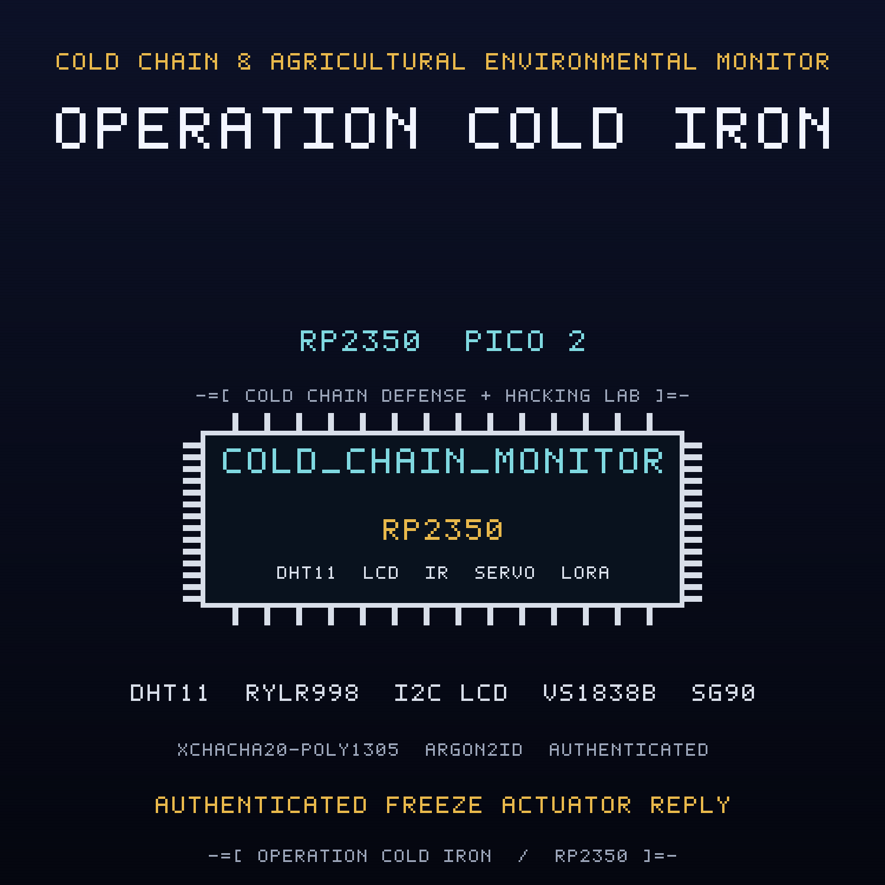

<br>

## FREE Reverse Engineering Self-Study Course [HERE](https://github.com/mytechnotalent/reverse-engineering)
## FREE Embedded Hacking Course [HERE](https://github.com/mytechnotalent/Embedded-Hacking)

<br>

# OPERATION COLD IRON CTF

### Act I - The compromised cold-chain depot node

<br>

***
**LEGAL DISCLAIMER:**
The information, tools, and code provided in this repository and course are strictly for educational, research, and defensive purposes only. 

You are explicitly prohibited from using any materials contained herein to access, test, modify, or exploit any device, network, or system that you do not own 100% or for which you do not have explicit, documented, and legally binding authorization to interact with.

By using this repository and course, you acknowledge and agree that:

1. Any illegal, unauthorized, or malicious use of this information is solely your responsibility.
2. The author(s) and contributor(s) of this repository and course shall not be held liable for any damages, legal repercussions, criminal charges, or unauthorized actions resulting from the use, misuse, or abuse of the contents herein.
3. You will comply with all applicable local, state, national, and international laws regarding cybersecurity and computer fraud.

**IF YOU DO NOT AGREE WITH THESE TERMS, DO NOT USE THIS REPOSITORY AND COURSE.**
***

<br>
<br>

> Hello, friend.
>
> NIGHTINGALE copied this firmware from a depot node that swore the cold store
> was a perfect minus eighteen degrees while the wall thermometer read five above
> zero. She sent us the image and then the messages stopped.
>
> You have her binary. You have the breadboard. You have a debug probe. What you
> do not have is time: the next shipment leaves the dock at dawn.

This is the companion capture-the-flag to the
[cold-chain-monitor](https://github.com/mytechnotalent/cold-chain-monitor)
project. Where the project builds the defended device, this CTF hands you the
**compromised** device FROSTLINE shipped and asks you to find every backdoor,
prove it on real hardware, and patch the binary.

<br>

## THE MISSION

The `ACT-I.bin` image is the OPERATION COLD IRON node with **six deliberate
defects** and **two recovery objectives**. Each defect is an in-place,
same-size byte patch, so no address moves when you fix it. Every fix is provable
on a Pico 2 with a Debug Probe.

| # | Name | What FROSTLINE did |
| - | ---- | ------------------ |
| 1 | Cold offset | shifted the breach threshold so a warm store still reports NOMINAL |
| 2 | Dead annunciator | inverted the LED branch so the red lamp never lights on breach |
| 3 | Damper geometry | corrupted the servo seal pulse so the damper never fully closes |
| 4 | Open infrared door | inverted the maintenance-address gate so any remote passes |
| 5 | Constant tag | inverted the AEAD tag branch so a forged frame authenticates |
| 6 | Nonce reuse | zeroed the nonce loop bound so every sealed frame reuses the nonce |

Plus two recovery objectives: capture the runtime-derived field key with GDB,
and recover the provisioned passphrase and salt from flash and re-derive it.

<br>

## THE ARTIFACTS

| File | Role | SHA-256 |
| ---- | ---- | ------- |
| `ACT-I.bin` | compromised firmware, the target | `b6fced1c0c305fdf167ed2da93464997504e1126d552eb120016d34c3a0bc47a` |
| `ACT-I.uf2` | flashable image of the target | `015e31dfeec6728afbc3a606d8b7b0283666f994acf124e56d0ed182119033f4` |
| `ACT-I_fixed.bin` | corrected firmware, the solution | `e63c513a8b798c0e4be9265e4313b8d882f3b6fd8e9ae1161316adad7a926e29` |
| `ACT-I_fixed.uf2` | flashable image of the solution | `f5df73b6ca69d4384ae64ffc39920e8d36634639a12b23904a962bd743332bf8` |

The two `.bin` files differ in exactly six bytes at offsets
`0x759E, 0x754F, 0x7686, 0x6569, 0x7AFF, 0x7858`.

<br>

## THE DOCUMENTS

| Document | For |
| -------- | --- |
| [`ACT-I-I.md`](ACT-I-I.md) / `.pdf` | Student instructions: the scenario, the tasks, the wiring |
| [`ACT-I-R.md`](ACT-I-R.md) / `.pdf` | Requirements and grading criteria |
| [`ACT-I-S.md`](ACT-I-S.md) / `.pdf` | Instructor solution key with exact offsets and bytes |
| [`ACT-I-main-disasm.txt`](ACT-I-main-disasm.txt) | Annotated disassembly of the six sabotage sites |
| [`DESIGN.md`](DESIGN.md) | Build blueprint (instructor eyes only) |

<br>

## HARDWARE

Everything runs on the Embedded Hacking breadboard: a Pico 2, a Debug Probe, a
DHT11, a 1602 I2C LCD, three status LEDs, a push button, an SG90 servo with a
1000uF cap, a VS1838B infrared receiver with an NEC remote, and a RYLR998 LoRa
radio. The pin map is in the instructions.

<br>

## QUICK START

Verify the two images against the expected patches and hashes:

```bash
python3 scripts/verify_ctf.py
```

Expected:

```text
12/12 checks passed
```

Build the corrected firmware from source:

```bash
rm -rf build && cmake -S . -B build -G Ninja -DPICO_BOARD=pico2 -DPICO_PLATFORM=rp2350-arm-s && cmake --build build
```

Run the firmware code standard audit:

```bash
python3 scripts/audit_c_standard.py
```

<br>

## REPOSITORY LAYOUT

```text
ACT-I-I.md / .pdf        student instructions
ACT-I-R.md / .pdf        requirements and grading criteria
ACT-I-S.md / .pdf        instructor solution key
ACT-I.bin / .uf2         compromised artifact
ACT-I_fixed.bin / .uf2   corrected artifact
ACT-I-main-disasm.txt    annotated sabotage sites
scripts/verify_ctf.py     machine verifier
scripts/spoof.py          framed for the classroom attack labs
src/  include/  ghidra/   firmware sources
CMakeLists.txt            Pico SDK build
DESIGN.md                 build blueprint
```

<br>

## WHERE THIS FITS: OPERATION COLD IRON

This is the companion CTF for **Act I (COLD IRON)** of the ten-act OPERATION COLD
IRON saga. The project it attacks is
[cold-chain-monitor](https://github.com/mytechnotalent/cold-chain-monitor). The
full spine is in [SAGA.md](SAGA.md).

- This act: Act I, COLD IRON
- Next act: Act II, IRON GATE, [CTF_access-gate](https://github.com/mytechnotalent/CTF_access-gate)


<br>

## THE MINISTRY

The Ministry runs the state: the surveillance, the cold chain, the gates, the
pipelines. NorthPharma is one of its deniable industrial fronts, and FROSTLINE is
the contractor that does the work no Ministry letterhead will admit to. Against
them is WHITEOUT, and the engineer who copied this image, NIGHTINGALE. This act is
one node of the Ministry's industrial edge. TELESCREEN, the surveillance backbone
that watches it, comes after the ten.


<br>

## THE ROADMAP

OPERATION COLD IRON is the fifth investigation in the Embedded Hacking series,
alongside `CTF-01`, `CTF-02`, `FINAL-01`, and `FINAL-02`. It is the first one
with two independent unauthenticated attack surfaces (LoRa and infrared) and a
physical actuator consequence, and the first to fix a broken AEAD with real
cryptography rather than a string patch.

<br>

# Next
[OPERATION IRON GATE](https://github.com/mytechnotalent/access-gate)

<br>

# License
[MIT License](https://github.com/mytechnotalent/CTF_cold-chain-monitor/blob/main/LICENSE)
